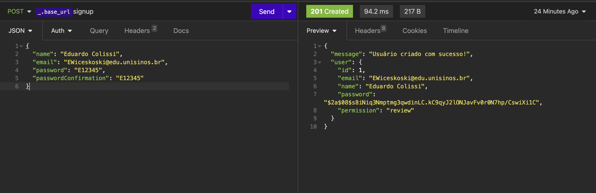
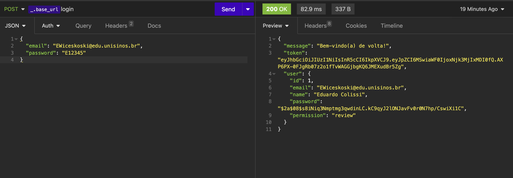

# UniXS - API

API desenvolvida em Node e Typescript objetivando alimentar a aplicação web do projeto. Com intuito de permitir a criação, edição e exclusão de novos fluxos, etapas e subetapas de processos internos da Universidade do Vale do Rio dos Sinos.

## Rodando a API

- Navegue até a raiz do projeto:

`cd backend`

- Navegue para a branch escolhida:

`git checkout nomeDaBranch`

- Atualize a branch local:

`git pull`

- Instale as dependências:

`npm install`

- Após isso, criamos um arquivo chamado .env e digitamos suas configurações:

- Execute o projeto:

`npm run dev`

## Configuração do Insomnia

- Para testarmos as rotas, utilizamos um software chamado Insomnia. Após baixado e instalado, crie uma nova Collection para o projeto:

- Após, criamos algumas variáveis de ambiente, para facilitar os testes:

- Agora, devemos criar uma rota de cadastro, para cadastrarmos o nosso usuário, e poder automatizar a geração do JSON WEB TOKEN:

- Pronto, temos um usuário cadastrado, agora, podemos criar a rota de login:

- Por fim, temos que definir que essa rota sempre gerará o token que alimentará as nossas outras rotas, para isso, seguimos esses passos:

- Prontinho, agora que temos um token configurado, sempre que precisarmos acessar outra rota, sem ser a de login e a de signup, basta utilizar a rota de login 1 vez e automaticamente, todas as outras rotas configuradas com a variável do token, estarão liberadas.

- Configurando outras rotas com o token:

## Configuração do Prisma

- Sempre que mudarmos algo na modelagem, ou seja, no arquvio schema.prisma, precisamos rodar o comando:

`npx prisma migrate dev`

E digitar o nome da migration, por exemplo: "added_name_field_in_user_table".

- Quando quisermos atualizar o banco de dados, usamos o comando:

`npx prisma db push`

- E para atualizar as migrations (SQL) usamos o comando:

`npx prisma generate`

## Utilização de rotas

- Cadastro de usuário (SignUp)

- Login
  
